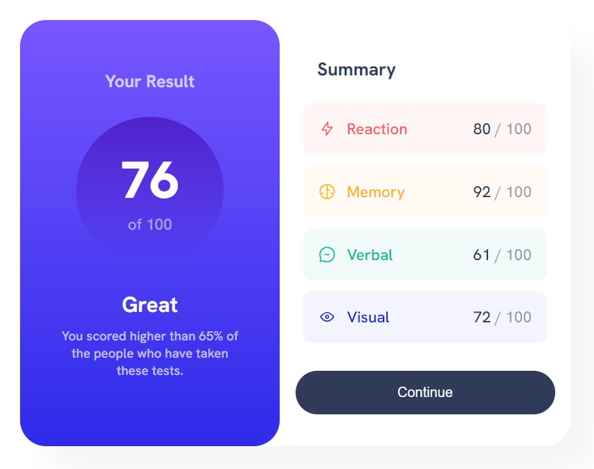

# Frontend Mentor - Results summary component solution

This is a solution to the [Results summary component challenge on Frontend Mentor](https://www.frontendmentor.io/challenges/results-summary-component-CE_K6s0maV). Frontend Mentor challenges help you improve your coding skills by building realistic projects. 

## Table of contents

- [Overview](#overview)
  - [The challenge](#the-challenge)
  - [Screenshot](#screenshot)
  - [Links](#links)
- [My process](#my-process)
  - [Built with](#built-with)
  - [What I learned](#what-i-learned)
  - [Continued development](#continued-development)
- [Author](#author)

## Overview

### The challenge

Users should be able to:

- View the optimal layout for the interface depending on their device's screen size
- See hover and focus states for all interactive elements on the page

### Screenshot

### Links

- Solution URL: [https://www.frontendmentor.io/solutions/results-summary-component-htmlcss-7ECABGdULQ](https://www.frontendmentor.io/solutions/results-summary-component-htmlcss-7ECABGdULQ)
- Live Site URL: [https://anetakak.github.io/frontend-mentor-2/](https://anetakak.github.io/frontend-mentor-2/)

## My process

### Built with

- Semantic HTML5 markup
- CSS custom properties
- Flexbox
- Mobile-first workflow

### What I learned

I practiced creating a component to consolidate my knowledge.

### Continued development

I want to focus on developing my skills. I hope to solve increasingly advanced challenges.

## Author

- Github - [anetakak](https://github.com/anetakak)
- Frontend Mentor - [@anetakak](https://www.frontendmentor.io/profile/anetakak)
